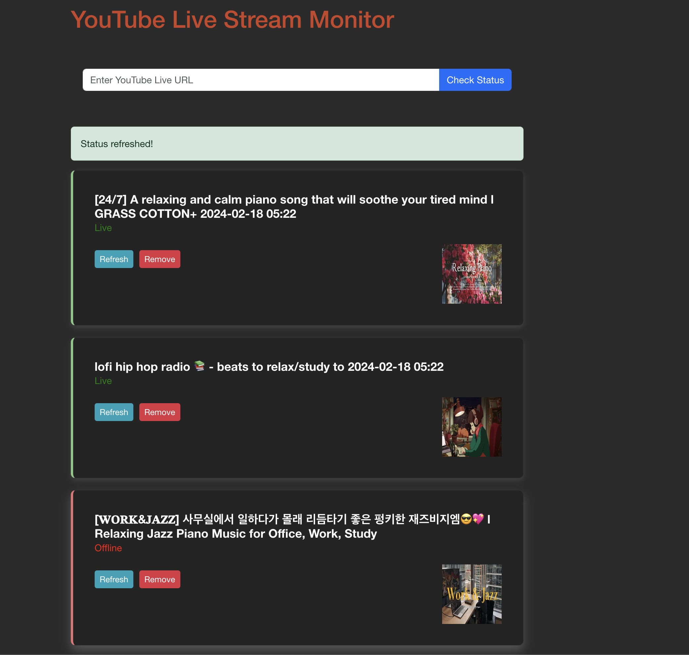

# YT Livestream Monitor

## Description

YT Livestream Monitor is a comprehensive tool designed to track and analyze YouTube livestreams.



## Installation

### Prerequisites

- Python 3.6+
- Node.js 12+
- Docker (optional)

### Docker Installation

If you have Docker installed, you can set up the project using Docker containers.

1. Build the Docker image:

   ```
    cd yt-livestream-monitor/yt_livestream_monitor
   
    docker compose up -d
    ```

2. go to <http://localhost:3000>

### Backend Installation with Virtualenv

       // make sure you are using python3 not 2 when using 'python' or 'pip' command

1. Clone the repository:

   ```
   git clone https://github.com/leonrlr4/yt-livestream-monitor.git
   ```

2. Navigate to the project directory:

   ```
   cd yt-livestream-monitor/yt_livestream_monitor/backend
   ```

3. Create a Python virtual environment and activate it:

   install virtualenv with ```pip install virtualenv``` command

   ```
   virtualenv venv
   source venv/bin/activate
   ```

4. Install the required Python packages using pip:

   ```
   pip install -r requirements.txt
   ```

5. Launch django server

    ```python manage.py runserver```

### Frontend Installation with Node.js

1. Open a new terminal session and navigate to the frontend directory:

   ```
   cd yt-livestream-monitor/yt_livestream_monitor/frontend
   ```

2. Install Node.js dependencies using `npm`:

   ```
   npm install
   ```

3. To start the frontend server, run:

   ```
   npm start
   ```

### Testing

- Frontend

   ```
   npm test
   ```

- Backend

   ```
   python manage.py test monitor
    ```

## Usage

After installation, you can start monitoring YouTube livestreams by navigating to the web interface provided by the frontend server  <http://localhost:3000> and enter the livestreams url you wish to monitor.

#### status

- green:  live :+1:
- red:    offline :-1:

#### features

- click card to go to the stream page

- remove and update function

- not allowed to check same url if is in the list

- empty or invalid yt live url are not allowed
